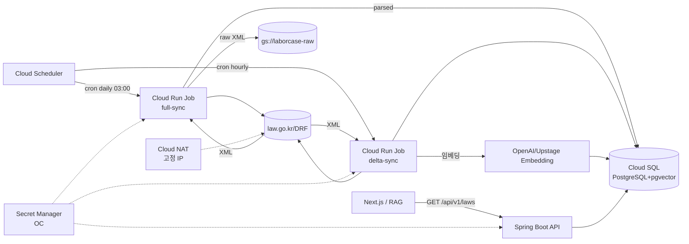

# 🗺️ 계획: 법제처 Open API 기반 노동법 조문 수집·조회 파이프라인

## 목표 (What & Why)

이 플랜이 끝났을 때 달성되는 상태:

- 6개 노동 관련 법령(근기법·최임법·퇴직급여법·남녀고용평등법·기간제법·파견법)의 **현행 조문 원문과 메타**가 Cloud SQL(PostgreSQL) + Cloud Storage 에 자동으로 수집·최신화된다.
- Spring Boot API 가 `GET /api/v1/laws/{lawId}/articles?jo=...` 형태로 조문을 JSON 응답하고, 각 응답은 공공누리 1유형 **출처 메타**를 포함한다.
- pgvector 에 조문 단위 임베딩이 적재되어 후속 RAG·판례 매칭 파이프라인이 소비 가능한 상태.
- 일 1회 `lsHistory` 배치가 돌고, 시행일 7일 이내 법령은 시간 1회로 승격되어 개정이 24시간 이내 반영된다.

**왜 이 순서인가**: 분석 §P2(사전 벌크 + 주기 동기화) 결정에 따라 수집 파이프라인 없이 API 를 먼저 만들 수 없다. 또한 실제 응답 스키마가 문서와 다를 수 있으므로(§R8) **Task 0 PoC** 로 검증 후 본격 구현에 진입한다.

**전제**:
- 레포 분리 플랜이 선행 완료되어 `api/` 와 `pipeline/` 코드를 public 레포에 커밋할 수 있는 상태.
- GCP 프로젝트 생성·billing 연결·Cloud Run/Cloud SQL/Secret Manager API 활성화 완료.
- 법제처 OC 발급 신청 완료(1~2일 소요). Task 0 시작 전 발급 완료 상태.
- 고정 egress IP 가 법제처에 등록 완료.

## 아키텍처 / 구조 개요



## 파일 / 모듈 변경 목록

> 경로는 CLAUDE.md §101 디렉토리 구조 기준. Kotlin/Spring Boot 는 `/api`, 파이프라인 배치 Job 도 Kotlin 기반으로 `/pipeline` 에 둔다(수집 로직과 API 가 동일 도메인 모델 공유).

| 경로 | 신규/수정 | 역할 |
|---|---|---|
| `infra/terraform/nat.tf` | 신규 | Cloud NAT + 고정 IP + Cloud Router |
| `infra/terraform/secrets.tf` | 신규 | Secret Manager secret `law-oc` 정의, IAM 바인딩 |
| `infra/terraform/db.tf` | 신규/확장 | pgvector extension 활성화, laborcase DB |
| `infra/terraform/scheduler.tf` | 신규 | Cloud Scheduler 2개 (full-sync, delta-sync) |
| `api/src/main/resources/db/migration/V1__law_schema.sql` | 신규 | Flyway: law / law_version / article / article_embedding |
| `api/src/main/kotlin/kr/laborcase/law/domain/` | 신규 | `Law`, `LawVersion`, `Article`, `ArticleLocator(jo, hang, ho, mok)` |
| `api/src/main/kotlin/kr/laborcase/law/client/LawOpenApiClient.kt` | 신규 | DRF HTTP 클라이언트 (`lawSearch`, `lawService`, `lsHistory`) |
| `api/src/main/kotlin/kr/laborcase/law/client/LawXmlParser.kt` | 신규 | XML → 도메인 변환 |
| `api/src/main/kotlin/kr/laborcase/law/repository/` | 신규 | JPA Repository + JDBC (pgvector) |
| `api/src/main/kotlin/kr/laborcase/law/service/LawQueryService.kt` | 신규 | 조회 유스케이스 |
| `api/src/main/kotlin/kr/laborcase/law/web/LawController.kt` | 신규 | REST 엔드포인트 + 출처 메타 래퍼 |
| `api/src/test/resources/fixtures/drf/` | 신규 | 실제 응답 XML 스냅샷(Task 0 산출물) |
| `pipeline/src/main/kotlin/kr/laborcase/pipeline/FullSyncJob.kt` | 신규 | 6개 법령 전체 재수집 |
| `pipeline/src/main/kotlin/kr/laborcase/pipeline/DeltaSyncJob.kt` | 신규 | lsHistory 폴링 + 변경 법령 갱신 |
| `pipeline/src/main/kotlin/kr/laborcase/pipeline/RawXmlStore.kt` | 신규 | GCS 저장 래퍼 |
| `pipeline/src/main/kotlin/kr/laborcase/pipeline/embedding/ArticleEmbedder.kt` | 신규 | 조문 임베딩 생성 |
| `docs/runbooks/law-sync-failure.md` | 신규 | 배치 실패 대응 |
| `README.md` | 수정 | 공공누리 1유형 출처표시 추가 |

## 작업 단위 (Tasks)

> TDD 원칙(CLAUDE.md §185): 각 task 의 "먼저 작성할 테스트" 가 먼저 commit, 구현은 별도 commit. Given/When/Then 패턴 (글로벌 CLAUDE.md).

---

### Task 0: DRF API PoC — 실제 응답 fixture 확보

- **목적**: 리서치 §R8 및 분석 §검증 필요 1·2 해소. 실제 응답이 문서와 일치하는지 확인하고, 이후 모든 파서·계약 테스트의 기준이 될 fixture XML 을 레포에 박제.
- **선행 조건**: OC 발급 완료, Cloud NAT 고정 IP 등록 완료.
- **작업 내용**:
  - [x] OC 를 로컬에 임시 환경변수로 주입, 고정 IP 가 있는 VM(또는 로컬 + IP 임시 등록)에서 호출. (IP 등록 없이도 로컬 IP 에서 통과됨, 도메인 "없음" 신청 덕분)
  - [x] `lawSearch.do?target=law&query=근로기준법` 응답 저장 → `docs/research/drf-fixtures/lawSearch_근로기준법.xml` (api/ 모듈 생성 전까지 임시 경로)
  - [x] `lawService.do?target=law&ID={확정된 lsId}` 응답 저장
  - [x] `lawService.do?target=lawjosub&ID=...&JO=002300` (제23조, 부당해고) 응답 저장 — JO 포맷 정정(리서치 "6자리 zero-pad" → 실제 "n*100 zero-pad")
  - [~] `lawSearch.do?target=lsHistory&query=근로기준법` 응답 저장 — **권한 누락으로 실패**, 재검색 방식으로 대체(구현 노트 참조)
  - [x] 6개 법령의 `lsId` 를 표로 정리 → `docs/research/labor-law-identifiers.md` 에 커밋
- **DoD**:
  - [x] 6개 법령 각각의 `lsId` 확정 (리서치에서 비어있던 항목 포함).
  - [x] 4개 엔드포인트 중 3개 fixture XML 이 레포에 존재 (lsHistory 는 권한 에러 응답도 보존).
  - [x] 응답 스키마가 문서와 다른 점이 있다면 `docs/research/drf-schema-notes.md` 로 메모. — JO 포맷, OC 유출, CDATA 전각기호 등 6건 기록.
- **검증 방법**: fixture XML 을 직접 열어 예상 필드(조문번호·조문내용·항·호·목)가 있는지 수동 확인.
- **실제 소요**: 1h
- **구현 노트**: [2026-04-24_task0-drf-poc](./2026-04-24_task0-drf-poc.md)

---

### Task 1: Terraform — Cloud NAT 고정 IP + Secret Manager

- **목적**: API 호출 출구 IP 고정과 OC 안전 보관(§P6).
- **선행 조건**: 없음 (Task 0 과 병렬 가능, 단 Task 0 수행 전에 IP 확정 필요).
- **작업 내용**:
  - [ ] 먼저 작성할 테스트: `terraform plan` 이 drift 없이 실행되는지 CI workflow (`.github/workflows/infra-plan.yml`).
  - [ ] 구현:
    - [ ] VPC + Cloud Router + Cloud NAT + External Static IP.
    - [ ] Secret Manager secret `law-oc` (값은 수동 `gcloud secrets versions add`, Terraform 은 리소스만).
    - [ ] Cloud Run Job/Service 용 서비스계정 2개(`law-sync-sa`, `api-sa`) + `roles/secretmanager.secretAccessor` 바인딩.
  - [ ] 리팩토링: IP 를 `outputs.tf` 로 노출 → 법제처 등록용 값 출력.
- **DoD**:
  - [ ] `terraform apply` 성공, 고정 IP 값을 법제처에 등록 완료.
  - [ ] `gcloud secrets versions access latest --secret=law-oc` 으로 OC 를 SA 권한으로 읽을 수 있음.
- **검증 방법**: Cloud Shell 에서 `curl --interface <내부IP> https://www.law.go.kr` 결과의 외부 IP 가 예상 고정 IP 인지 확인 (또는 Cloud Run Job smoke test).
- **예상 시간**: 3h

---

### Task 2: DB 스키마 — Flyway 마이그레이션

- **목적**: §P3 결정대로 법령·버전·조문 3-테이블 구조 + 임베딩 테이블.
- **선행 조건**: Task 0 (lsId 확정), Task 1 (Cloud SQL 존재).
- **작업 내용**:
  - [ ] 먼저 작성할 테스트: `LawSchemaMigrationTest.kt` — Testcontainers(postgres:16 + pgvector 이미지)로 마이그레이션 후 모든 테이블/인덱스 존재 확인.
  - [ ] 구현 (`V1__law_schema.sql`):
    - [ ] `law(id uuid pk, ls_id varchar unique, name_kr text, short_name text, created_at)`
    - [ ] `law_version(id uuid pk, law_id fk, lsi_seq varchar, promulgation_date date, effective_date date, promulgation_no text, is_current boolean, raw_xml_gcs_uri text, fetched_at timestamptz, unique(law_id, lsi_seq))`
    - [ ] `article(id uuid pk, law_version_id fk, jo char(6), hang char(6) null, ho char(6) null, mok varchar(4) null, title text, body text, effective_date date null, unique(law_version_id, jo, hang, ho, mok))`
    - [ ] `article_embedding(article_id uuid pk fk, vector vector(1536), embedded_at timestamptz)` + ivfflat 인덱스.
    - [ ] `sync_log(id uuid pk, job_name text, started_at, finished_at, status, error_message, versions_changed int)`
  - [ ] `CREATE EXTENSION IF NOT EXISTS vector;` 을 V0 로 분리.
- **DoD**:
  - [ ] Testcontainers 테스트 green.
  - [ ] Cloud SQL 에 마이그레이션 적용 성공, `\d law_version` 결과가 예상과 일치.
- **검증 방법**: `psql` 로 테이블 목록·제약 확인.
- **예상 시간**: 3h

---

### Task 3: DRF HTTP 클라이언트 — `LawOpenApiClient`

- **목적**: `lawSearch.do`, `lawService.do`(target=law / lawjosub), `lsHistory` 4개 호출을 래핑한 Kotlin 인터페이스.
- **선행 조건**: Task 0 (fixture), Task 1 (OC 주입 가능).
- **작업 내용**:
  - [ ] 먼저 작성할 테스트 (Given/When/Then):
    - [ ] `LawOpenApiClientContractTest.kt` — WireMock + Task 0 fixture XML 을 리턴하게 세팅, 각 메서드가 올바른 URL/쿼리/헤더를 생성하는지, 응답이 도메인으로 파싱되는지.
  - [ ] 구현:
    - [ ] Spring 6 `RestClient` 사용, baseUrl `https://www.law.go.kr/DRF`.
    - [ ] `searchLaws(query)`, `fetchLawByLsId(lsId, efYd?)`, `fetchArticle(lsId, jo, hang?, ho?, mok?, efYd?)`, `fetchHistory(query)` 4개 메서드.
    - [ ] OC 는 `@Value("\${law.oc}")` 로 주입, 모든 URL 쿼리에 자동 첨부.
    - [ ] `type=XML` 고정. JSON 미사용 이유 주석(문서 완결성이 XML 쪽이 높음).
    - [ ] 429/5xx 재시도 3회(exponential), 4xx 즉시 실패.
  - [ ] 리팩토링: URL 생성 로직을 `LawOpenApiUrlBuilder` 로 추출.
- **DoD**:
  - [ ] 계약 테스트 4개 메서드 모두 green.
  - [ ] 고정 IP 환경에서 실제 호출 1회 수동 성공 (임시 integration test, `@Tag("live")` 로 CI 제외).
- **검증 방법**: `./gradlew :api:test --tests "*LawOpenApiClientContractTest"`
- **예상 시간**: 4h

---

### Task 4: XML 파서 — `LawXmlParser`

- **목적**: 원문 XML → `Law`, `LawVersion`, `Article` 도메인 객체 변환. 중첩 구조(조→항→호→목) 정확히 평탄화.
- **선행 조건**: Task 0 (fixture), Task 2 (도메인 클래스).
- **작업 내용**:
  - [ ] 먼저 작성할 테스트:
    - [ ] `LawXmlParserTest.kt` — 근로기준법 fixture 를 파싱해 조항 수·특정 조문(제2조 정의, 제23조 해고 제한)의 본문이 예상과 일치하는지.
    - [ ] 누락 필드(항 없음, 호 없음)에서 null 전파 확인.
  - [ ] 구현:
    - [ ] JAXB 또는 `XmlMapper`(Jackson) 선택 — 리팩토링 용이성 기준 Jackson.
    - [ ] 조문 평탄화: `(조, null, null, null)`, `(조, 항, null, null)`, `(조, 항, 호, null)`, `(조, 항, 호, 목)` 까지 4-레벨 레코드로 전개.
    - [ ] 조문 번호는 6자리 zero-pad 유지(영속 키 규칙 §R6).
- **DoD**:
  - [ ] 근로기준법 fixture 에서 100+ 조문 파싱, 샘플링 5건 수동 검수와 일치.
  - [ ] 파서 테스트 green.
- **검증 방법**: 테스트 + 근로기준법 제23조 본문 스냅샷 매칭.
- **예상 시간**: 3h

---

### Task 5: GCS raw zone + `RawXmlStore`

- **목적**: 원문 XML 불변 보관(§P3). 감사 목적으로 lsId+lsiSeq 키로 접근 가능하게.
- **선행 조건**: Task 1 (GCS 버킷은 Terraform 에 포함).
- **작업 내용**:
  - [ ] 먼저 작성할 테스트: Testcontainers GCS 에뮬레이터(fake-gcs-server) 이용한 `RawXmlStoreTest.kt`.
  - [ ] 구현:
    - [ ] `put(lsId, lsiSeq, xml): GcsUri` — 경로 `gs://laborcase-raw/law/{lsId}/{lsiSeq}.xml`, `Content-Type: application/xml`, 불변 객체(versioning 활성 버킷).
    - [ ] `exists(lsId, lsiSeq): Boolean` — 중복 저장 방지.
  - [ ] `infra/terraform/storage.tf` 에 `laborcase-raw` 버킷 + versioning + retention 365일.
- **DoD**:
  - [ ] 테스트 green.
  - [ ] 실제 GCS 에 Task 0 fixture 1건 업로드 성공, `gsutil ls` 로 확인.
- **검증 방법**: GCS 콘솔에서 객체 메타데이터 확인.
- **예상 시간**: 2h

---

### Task 6: FullSyncJob — 6개 법령 초기 벌크 수집

- **목적**: 6개 법령의 현행 버전을 모두 수집·파싱·저장·임베딩.
- **선행 조건**: Task 2, 3, 4, 5.
- **작업 내용**:
  - [ ] 먼저 작성할 테스트: `FullSyncJobIntegrationTest.kt` — Testcontainers Postgres + WireMock DRF + fake GCS. 6개 법령 중 2개 fixture 로 시드하고 Job 실행 후 DB 상태 확인.
  - [ ] 구현:
    - [ ] `laborcase.law.seed.yaml` 에 6개 법령의 `{약칭, lsId}` 기재 (Task 0 결과).
    - [ ] Job 흐름: 각 법령별 → (1) `fetchLawByLsId` → (2) `RawXmlStore.put` → (3) `LawXmlParser.parse` → (4) upsert `law_version`(is_current=true, 이전 버전 false) → (5) upsert articles → (6) 임베딩(Task 9 와 동시/후속, 플래그로 제어).
    - [ ] 트랜잭션 경계: 법령 1건을 1 트랜잭션으로. 실패 시 롤백, `sync_log` 에 기록.
    - [ ] 멱등성: 같은 `(lsId, lsiSeq)` 로 재실행 시 no-op.
  - [ ] 리팩토링: 수집/저장/임베딩을 단계별 `Step` 클래스로 분리 가능하게.
- **DoD**:
  - [ ] 통합 테스트 green.
  - [ ] Cloud Run Job 으로 수동 실행 1회 성공, `select count(*) from article where law_version_id=...` 로 예상 조문 수 검증.
- **검증 방법**: `gcloud run jobs execute law-full-sync --region=...`
- **예상 시간**: 4h

---

### Task 7: DeltaSyncJob — lsHistory 폴링 증분 갱신

- **목적**: §P5 결정. 일 1회 + 시행 임박 시 시간 1회.
- **선행 조건**: Task 6.
- **작업 내용**:
  - [ ] 먼저 작성할 테스트: `DeltaSyncJobTest.kt` — lsHistory 응답에 새 `lsiSeq` 가 있으면 해당 법령만 재수집되는지, 변경 없으면 no-op 인지.
  - [ ] 구현:
    - [ ] 각 법령의 최근 `lsHistory` 조회 → 응답 최상단 `lsiSeq` 와 DB `is_current=true` 버전의 `lsi_seq` 비교.
    - [ ] 다르면 Task 6 의 수집 단계 재사용하여 새 버전 추가 및 이전 버전 `is_current=false`.
    - [ ] 응답의 다음 시행일이 `today+7d` 이내인 법령 목록을 `upcoming_laws` 테이블(또는 설정)로 마킹.
  - [ ] 스케줄러(Task 10)에서 이 마킹을 읽어 주기 조정.
- **DoD**:
  - [ ] 테스트 green (변경 있음/없음 2 시나리오).
  - [ ] 수동 실행으로 DB 내 현행 버전이 변하지 않음(현 시점 개정 없음 가정) 확인.
- **검증 방법**: `select lsi_seq, is_current, fetched_at from law_version;`
- **예상 시간**: 3h

---

### Task 8: 조문 임베딩 파이프라인 — `ArticleEmbedder`

- **목적**: `article.body` 를 벡터화해 `article_embedding` 적재. RAG/판례 매칭의 기반.
- **선행 조건**: Task 4 (article 데이터 존재).
- **작업 내용**:
  - [ ] 먼저 작성할 테스트: 임베딩 프로바이더를 mock 으로 대체하고 `embedPending()` 이 미임베딩 조문만 처리하는지.
  - [ ] 구현:
    - [ ] 프로바이더 인터페이스 `EmbeddingProvider`. OpenAI `text-embedding-3-small` (1536 dim) 또는 Upstage — 환경변수 전환.
    - [ ] 텍스트 구성: `"{법령명} {조문번호} {조문제목}\n\n{body}"` 로 contextual 임베딩.
    - [ ] 배치 크기 20, 실패 시 재시도 3회.
    - [ ] 일일 비용 상한 환경변수 `EMBEDDING_DAILY_LIMIT_USD`.
  - [ ] FullSyncJob 과 DeltaSyncJob 에서 각각 호출.
- **DoD**:
  - [ ] 테스트 green.
  - [ ] 실제 OpenAI 호출 1회로 근기법 제23조 임베딩 저장, `select count(*) from article_embedding` > 0.
- **검증 방법**: pgvector `<->` 연산자로 "해고" 쿼리 근접 조문 3건이 의미적으로 맞는지 수동 확인.
- **예상 시간**: 3h

---

### Task 9: 조회 API — `LawController`

- **목적**: 외부 소비자(프론트/AI 서버) 가 쓸 REST 엔드포인트. 응답에 출처 메타 포함(§P7).
- **선행 조건**: Task 4, 6.
- **작업 내용**:
  - [ ] 먼저 작성할 테스트: `LawControllerTest.kt` — MockMvc, Given/When/Then.
    - [ ] 존재하는 법령/조문 조회 200 + 예상 필드.
    - [ ] 없는 조문 조회 404.
    - [ ] 응답에 `source.license="KOGL-1"`, `source.url` 포함 검증.
  - [ ] 구현:
    - [ ] `GET /api/v1/laws` — 법령 목록 (약칭·공식명·현 `lsiSeq`).
    - [ ] `GET /api/v1/laws/{lawShortName}/articles?jo=23&hang=1` — 조문 단일 조회.
    - [ ] `GET /api/v1/laws/{lawShortName}/articles` — 법령 내 전체 조문.
    - [ ] 응답 래퍼 `ApiResponse<T>(data: T, source: SourceMeta)` — 전체 컨트롤러에 적용.
    - [ ] `SourceMeta(license="KOGL-1", provider="법제처 국가법령정보센터", url="https://www.law.go.kr/lsInfoP.do?lsiSeq=...", retrievedAt=...)`.
    - [ ] `disclaimer` 필드도 응답 최상단에 포함 (CLAUDE.md §62 문구 고정).
  - [ ] 리팩토링: `SourceMeta` 생성 로직을 `SourceMetaFactory` 로.
- **DoD**:
  - [ ] MockMvc 테스트 3건 green.
  - [ ] 로컬에서 `curl localhost:8080/api/v1/laws/근로기준법/articles?jo=23` 응답 스키마가 예상과 일치.
- **검증 방법**: `./gradlew :api:bootRun` + curl.
- **예상 시간**: 3h

---

### Task 10: Cloud Scheduler + 임박 법령 동적 승격

- **목적**: §P5 "일 1회 + 임박 시 시간 1회" 자동화.
- **선행 조건**: Task 7.
- **작업 내용**:
  - [ ] 먼저 작성할 테스트: `upcoming_laws` 가 비면 hourly cron 이 no-op, 채워지면 실행되는 게이트 로직 테스트.
  - [ ] 구현 (`infra/terraform/scheduler.tf`):
    - [ ] `law-full-sync` — cron `0 3 * * *` Asia/Seoul, Cloud Run Job 호출.
    - [ ] `law-delta-sync` — cron `0 * * * *` Asia/Seoul.
    - [ ] delta job 진입 시 `upcoming_laws` 비어있으면 조기 종료 (쿼터 보호).
- **DoD**:
  - [ ] Terraform apply 성공, Scheduler UI 에 2개 표시.
  - [ ] 수동 트리거 2종 모두 성공 로그.
- **검증 방법**: Cloud Logging 에서 Job 실행 로그 확인.
- **예상 시간**: 2h

---

### Task 11: 관측성 — Sentry 연동 + `sync_log` UI 플래그

- **목적**: §R2 완화. 실패가 침묵하지 않도록.
- **선행 조건**: Task 6, 7.
- **작업 내용**:
  - [ ] 먼저 작성할 테스트: 의도적 실패 주입 시 Sentry Mock 에 이벤트가 전송되는지.
  - [ ] 구현:
    - [ ] `sentry-spring-boot-starter` 추가, DSN 은 Secret Manager.
    - [ ] Job 에서 예외 발생 시 Sentry 로그 + `sync_log.status='FAILED'` 기록.
    - [ ] API 응답 메타에 `lastSyncedAt` 포함. 값이 48h 이상 오래되면 `stale: true`.
  - [ ] 프론트(Phase 후속) 가 `stale: true` 일 때 배너 띄우도록 디자인 가이드 `docs/decisions/adr-0001-stale-data-banner.md`.
- **DoD**:
  - [ ] 강제 실패로 Sentry 이벤트 1건 수신.
  - [ ] API 응답에 `lastSyncedAt` 필드 존재.
- **검증 방법**: Sentry 대시보드 + curl.
- **예상 시간**: 2h

---

### Task 12: 출처표시 UI 앵커 + README 업데이트

- **목적**: §P7 의 3번째 앵커(README/footer) + 공공누리 준수 문서화.
- **선행 조건**: Task 9 (API 응답 메타 완성).
- **작업 내용**:
  - [ ] `README.md` 상단에 공공누리 1유형 배지·문구 추가.
  - [ ] `docs/legal/source-attribution.md` 신규: 기관명·연도·하이퍼링크 예시, "특수관계 오인 금지" 조항 인용.
  - [ ] `docs/runbooks/law-sync-failure.md` 신규: 배치 실패 시 수동 재실행, 법제처 IP 등록 상태 확인, Sentry 링크 연결 절차.
  - [ ] Frontend 렌더링 가이드는 분석 §P7 1·2번(조문 상세 상단, footer)은 프론트 태스크라 별도 플랜(`2026-04-??_frontend-law-view.md`)에서 다룬다고 크로스 링크.
- **DoD**:
  - [ ] 3개 문서 작성 완료, README 빌드 시 깨지지 않음.
- **검증 방법**: PR 프리뷰에서 렌더링 확인.
- **예상 시간**: 1.5h

---

## 의존성 그래프

```
Task 0 (PoC) ─┐
              ├─→ Task 2 (DB) ─┐
Task 1 (NAT/Secret) ───────────┤
                               ├─→ Task 3 (Client) ─┐
Task 0 ────────────────────────┘                    ├─→ Task 4 (Parser) ─┐
                                                    │                     │
Task 1 ─→ Task 5 (GCS) ─────────────────────────────┼─────────────────────┼─→ Task 6 (FullSync)
                                                    │                     │         │
                                                    │                     │         ├─→ Task 7 (DeltaSync) ─→ Task 10 (Scheduler)
                                                    │                     │         │
                                                    │                     │         └─→ Task 8 (Embedding)
                                                    │                     │
                                                    │                     └─→ Task 9 (API) ─→ Task 12 (README/출처)
                                                    │                               │
                                                    └───────────────────────────────┴─→ Task 11 (관측성)
```

## 검증 필요 (PoC)

이미 Task 0 으로 **분석 §검증 필요 1·2** 를 다룬다. 그 외에도 구현 중 체크할 항목:

- ❓ 공공데이터포털 경로가 `lawjosub` 동등 기능을 갖는지 (R1 폴백 가능성). → Task 0 에 포함.
- ❓ 6개 법령 조문 수·평균 글자 수 → Task 4 이후 `sync_log` 에 메트릭 남기면 확인 가능.
- ❓ 임베딩 프로바이더 정확도: OpenAI vs Upstage — Task 8 완료 후 "해고/임금/휴가" 쿼리 top-10 정성평가 별도 ADR.
- ❓ 법제처 담당자 문의(044-200-6797): 일일 호출량 설명과 제한 정책 확인. Task 1 직후.
- ❓ 판례 참조 구법 번호 불일치 빈도 — 판례 수집 플랜(별도)에서 PoC. 결과에 따라 분석 §P4 사용자 결정 (a)→(b) 마이그레이션 계획 업데이트.

## 롤백 계획

단계별 롤백 가능성을 확보해 "잘못된 방향" 을 저비용으로 되돌린다.

| 시점 | 실패 징후 | 롤백 |
|---|---|---|
| Task 0 | 실제 응답이 문서와 크게 다름, 조항호목 파싱 불가 | 공공데이터포털 경로로 방향 전환, 분석 §P1 재검토 |
| Task 2 후 | 스키마 설계가 실제 XML 과 안 맞음 | Flyway `V2__schema_revise.sql` 로 forward-only 보정. 데이터 없으므로 비파괴 |
| Task 6 후 | 수집 시간이 과도(개별 법령 5분+) 또는 쿼터 경고 | sleep 간격 추가, 병렬도 감소, lawjosub 조회 최소화 |
| Task 8 후 | 임베딩 비용 과다 | `EMBEDDING_DAILY_LIMIT_USD` 로 차단, 배치 분산 |
| Task 10 후 | Scheduler 가 오동작 | Terraform 으로 cron 비활성화(enabled=false) → 수동 실행만 유지 |
| 전면 롤백 | 법제처 측 이용 중단 통보 | 수집 중단 + GCS raw XML 보존(이미 수집분은 사용 가능) → 공공데이터포털 경로로 재연결 |

각 Task 는 별도 PR 로 머지하여 revert 단위를 작게 유지한다. DB 는 forward-only 마이그레이션을 원칙으로 한다(데이터 삭제 금지, 새 마이그레이션으로 상쇄).

## 관련 노트

- 분석: [분석: 국가법령정보센터 Open API 사용 전략](./2026-04-24_national-law-open-api.md)
- 리서치: [리서치: 국가법령정보센터 Open API 실사](./2026-04-24_national-law-open-api.md)
- 선행 플랜: [analysis: 레포 분리 전략](./2026-04-24_public-private-repo-split.md) (구현 전 완료 권장)
- 예상 총 소요: **36h** (6주차 1인 파트타임 기준 약 3주)
- 구현 모드 진입: `/implement 2026-04-24_national-law-open-api.md`
