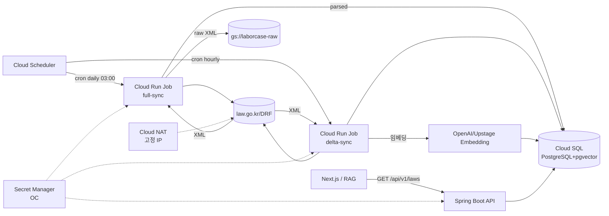

# 🗺️ 계획: 법제처 Open API 기반 노동법 조문 수집·조회 파이프라인

## 목표 (What & Why)

이 플랜이 끝났을 때 달성되는 상태:

- 6개 노동 관련 법령(근기법·최임법·퇴직급여법·남녀고용평등법·기간제법·파견법)의 **현행 조문 원문과 메타**가 Cloud SQL(PostgreSQL) + Cloud Storage 에 자동으로 수집·최신화된다.
- Spring Boot API 가 `GET /api/v1/laws/{lawId}/articles?jo=...` 형태로 조문을 JSON 응답하고, 각 응답은 공공누리 1유형 **출처 메타**를 포함한다.
- pgvector 에 조문 단위 임베딩이 적재되어 후속 RAG·판례 매칭 파이프라인이 소비 가능한 상태.
- 일 1회 `lsHistory` 배치가 돌고, 시행일 7일 이내 법령은 시간 1회로 승격되어 개정이 24시간 이내 반영된다.

**왜 이 순서인가**: 분석 §P2(사전 벌크 + 주기 동기화) 결정에 따라 수집 파이프라인 없이 API 를 먼저 만들 수 없다. 또한 실제 응답 스키마가 문서와 다를 수 있으므로(§R8) **Task 0 PoC** 로 검증 후 본격 구현에 진입한다.

**전제**:
- 레포 분리 플랜이 선행 완료되어 `api/` 와 `pipeline/` 코드를 public 레포에 커밋할 수 있는 상태.
- GCP 프로젝트 생성·billing 연결·Cloud Run/Cloud SQL/Secret Manager API 활성화 완료.
- 법제처 OC 발급 신청 완료(1~2일 소요). Task 0 시작 전 발급 완료 상태.
- 고정 egress IP 가 법제처에 등록 완료.

## 아키텍처 / 구조 개요



## 파일 / 모듈 변경 목록

> 경로는 CLAUDE.md §101 디렉토리 구조 기준. Kotlin/Spring Boot 는 `/api`, 파이프라인 배치 Job 도 Kotlin 기반으로 `/pipeline` 에 둔다(수집 로직과 API 가 동일 도메인 모델 공유).

| 경로 | 신규/수정 | 역할 |
|---|---|---|
| `infra/terraform/nat.tf` | 신규 | Cloud NAT + 고정 IP + Cloud Router |
| `infra/terraform/secrets.tf` | 신규 | Secret Manager secret `law-oc` 정의, IAM 바인딩 |
| `infra/terraform/db.tf` | 신규/확장 | pgvector extension 활성화, laborcase DB |
| `infra/terraform/scheduler.tf` | 신규 | Cloud Scheduler 2개 (full-sync, delta-sync) |
| `api/src/main/resources/db/migration/V1__law_schema.sql` | 신규 | Flyway: law / law_version / article / article_embedding |
| `api/src/main/kotlin/kr/laborcase/law/domain/` | 신규 | `Law`, `LawVersion`, `Article`, `ArticleLocator(jo, hang, ho, mok)` |
| `api/src/main/kotlin/kr/laborcase/law/client/LawOpenApiClient.kt` | 신규 | DRF HTTP 클라이언트 (`lawSearch`, `lawService`, `lsHistory`) |
| `api/src/main/kotlin/kr/laborcase/law/client/LawXmlParser.kt` | 신규 | XML → 도메인 변환 |
| `api/src/main/kotlin/kr/laborcase/law/repository/` | 신규 | JPA Repository + JDBC (pgvector) |
| `api/src/main/kotlin/kr/laborcase/law/service/LawQueryService.kt` | 신규 | 조회 유스케이스 |
| `api/src/main/kotlin/kr/laborcase/law/web/LawController.kt` | 신규 | REST 엔드포인트 + 출처 메타 래퍼 |
| `api/src/test/resources/fixtures/drf/` | 신규 | 실제 응답 XML 스냅샷(Task 0 산출물) |
| `pipeline/src/main/kotlin/kr/laborcase/pipeline/FullSyncJob.kt` | 신규 | 6개 법령 전체 재수집 |
| `pipeline/src/main/kotlin/kr/laborcase/pipeline/DeltaSyncJob.kt` | 신규 | lsHistory 폴링 + 변경 법령 갱신 |
| `pipeline/src/main/kotlin/kr/laborcase/pipeline/RawXmlStore.kt` | 신규 | GCS 저장 래퍼 |
| `pipeline/src/main/kotlin/kr/laborcase/pipeline/embedding/ArticleEmbedder.kt` | 신규 | 조문 임베딩 생성 |
| `docs/runbooks/law-sync-failure.md` | 신규 | 배치 실패 대응 |
| `README.md` | 수정 | 공공누리 1유형 출처표시 추가 |

## 작업 단위 (Tasks)

> TDD 원칙(CLAUDE.md §185): 각 task 의 "먼저 작성할 테스트" 가 먼저 commit, 구현은 별도 commit. Given/When/Then 패턴 (글로벌 CLAUDE.md).

---

### Task 0: DRF API PoC — 실제 응답 fixture 확보

- **목적**: 리서치 §R8 및 분석 §검증 필요 1·2 해소. 실제 응답이 문서와 일치하는지 확인하고, 이후 모든 파서·계약 테스트의 기준이 될 fixture XML 을 레포에 박제.
- **선행 조건**: OC 발급 완료, Cloud NAT 고정 IP 등록 완료.
- **작업 내용**:
  - [x] OC 를 로컬에 임시 환경변수로 주입, 고정 IP 가 있는 VM(또는 로컬 + IP 임시 등록)에서 호출. (IP 등록 없이도 로컬 IP 에서 통과됨, 도메인 "없음" 신청 덕분)
  - [x] `lawSearch.do?target=law&query=근로기준법` 응답 저장 → `docs/research/drf-fixtures/lawSearch_근로기준법.xml` (api/ 모듈 생성 전까지 임시 경로)
  - [x] `lawService.do?target=law&ID={확정된 lsId}` 응답 저장
  - [x] `lawService.do?target=lawjosub&ID=...&JO=002300` (제23조, 부당해고) 응답 저장 — JO 포맷 정정(리서치 "6자리 zero-pad" → 실제 "n*100 zero-pad")
  - [~] `lawSearch.do?target=lsHistory&query=근로기준법` 응답 저장 — **권한 누락으로 실패**, 재검색 방식으로 대체(구현 노트 참조)
  - [x] 6개 법령의 `lsId` 를 표로 정리 → `docs/research/labor-law-identifiers.md` 에 커밋
- **DoD**:
  - [x] 6개 법령 각각의 `lsId` 확정 (리서치에서 비어있던 항목 포함).
  - [x] 4개 엔드포인트 중 3개 fixture XML 이 레포에 존재 (lsHistory 는 권한 에러 응답도 보존).
  - [x] 응답 스키마가 문서와 다른 점이 있다면 `docs/research/drf-schema-notes.md` 로 메모. — JO 포맷, OC 유출, CDATA 전각기호 등 6건 기록.
- **검증 방법**: fixture XML 을 직접 열어 예상 필드(조문번호·조문내용·항·호·목)가 있는지 수동 확인.
- **실제 소요**: 1h
- **구현 노트**: [2026-04-24_task0-drf-poc](./2026-04-24_task0-drf-poc.md)

---

### Task 1: Terraform — Cloud NAT 고정 IP + Secret Manager

- **목적**: API 호출 출구 IP 고정과 OC 안전 보관(§P6).
- **선행 조건**: 없음 (Task 0 과 병렬 가능, 단 Task 0 수행 전에 IP 확정 필요).
- **작업 내용**:
  - [~] 먼저 작성할 테스트: `terraform plan` 이 drift 없이 실행되는지 CI workflow (`.github/workflows/infra-plan.yml`). — Task 2 합류 후 별도 PR 로 추가 예정
  - [x] 구현:
    - [x] VPC + Cloud Router + Cloud NAT + External Static IP.
    - [x] Secret Manager secret `law-oc` (값은 수동 `gcloud secrets versions add`, Terraform 은 리소스만).
    - [x] Cloud Run Job/Service 용 서비스계정 2개(`law-sync-sa`, `api-sa`) + `roles/secretmanager.secretAccessor` 바인딩.
  - [x] 리팩토링: IP 를 `outputs.tf` 로 노출 → 법제처 등록용 값 출력 (`34.64.141.102`).
- **DoD**:
  - [x] `terraform apply` 성공 (10 리소스 생성).
  - [ ] **고정 IP `34.64.141.102` 를 법제처에 등록** — 사용자 액션 필요 (open.law.go.kr OPEN API 신청 수정).
  - [x] `gcloud secrets versions access latest --secret=law-oc` 으로 OC 를 읽을 수 있음.
- **검증 방법**: Cloud Shell 에서 `curl --interface <내부IP> https://www.law.go.kr` 결과의 외부 IP 가 예상 고정 IP 인지 확인 (또는 Cloud Run Job smoke test).
- **실제 소요**: 1.5h
- **구현 노트**: [2026-04-24_task1-terraform-nat-secret](./2026-04-24_task1-terraform-nat-secret.md)

---

### Task 2: DB 스키마 — Flyway 마이그레이션

- **목적**: §P3 결정대로 법령·버전·조문 3-테이블 구조 + 임베딩 테이블.
- **선행 조건**: Task 0 (lsId 확정), Task 1 (Cloud SQL 존재).
- **작업 내용**:
  - [~] 먼저 작성할 테스트: `LawSchemaMigrationTest.kt` — **Testcontainers 대신 `scripts/dev-postgres.sh` 컨테이너** 사용(Docker 29 호환성 이슈). 마이그레이션 후 테이블/인덱스/확장 확인 + NULL 포함 조문 locator 중복 거부.
  - [x] 구현 (`V1__law_schema.sql`):
    - [x] `law(id uuid pk, ls_id varchar unique, name_kr text, short_name text, created_at)`
    - [x] `law_version(id uuid pk, law_id fk, lsi_seq varchar, promulgation_date date, effective_date date, promulgation_no text, is_current boolean, raw_xml_gcs_uri text, fetched_at timestamptz, unique(law_id, lsi_seq))`
    - [x] `article(id uuid pk, law_version_id fk, jo char(6), hang char(6) null, ho char(6) null, mok varchar(4) null, title text, body text, effective_date date null, unique NULLS NOT DISTINCT (law_version_id, jo, hang, ho, mok))`
    - [x] `article_embedding(article_id uuid pk fk, vector vector(1536), model text, embedded_at timestamptz)` + ivfflat(vector_cosine_ops) 인덱스.
    - [x] `sync_log(id uuid pk, job_name text, started_at, finished_at, status, error_message, versions_changed int)`
  - [x] `CREATE EXTENSION IF NOT EXISTS vector;` 을 V0 로 분리.
- **DoD**:
  - [x] 로컬 테스트 2건 모두 green.
  - [x] Cloud SQL 에 마이그레이션 적용 성공. 6 테이블 + pgvector 0.8.1 + flyway_schema_history 에 V0, V1 기록.
- **검증 방법**: `psql` 로 테이블 목록·제약 확인.
- **실제 소요**: 2.5h (Testcontainers/Docker 호환성 + Enterprise 에디션 이슈 포함).
- **구현 노트**: [2026-04-24_task2-db-schema](./2026-04-24_task2-db-schema.md)

---

### Task 3: DRF HTTP 클라이언트 — `LawOpenApiClient`

- **목적**: `lawSearch.do`, `lawService.do`(target=law / lawjosub), `lsHistory` 4개 호출을 래핑한 Kotlin 인터페이스.
- **선행 조건**: Task 0 (fixture), Task 1 (OC 주입 가능).
- **작업 내용**:
  - [x] 먼저 작성할 테스트 (Given/When/Then):
    - [x] `LawOpenApiClientContractTest.kt` — WireMock + Task 0 fixture XML. 각 메서드의 URL/쿼리 + 응답 파싱 + 재시도 + 권한실패 HTML 래핑 = 6 tests green.
  - [x] 구현:
    - [x] Spring 6 `RestClient` 사용, baseUrl `https://www.law.go.kr/DRF`.
    - [x] `searchLaws(query)`, `fetchLawByLsId(lsId, efYd?)`, `fetchArticle(lsId, locator, efYd?)`, `fetchHistory(query)` 4개 메서드. 단 `fetchHistory` 는 권한 없어 `UnsupportedOperationException` 스텁.
    - [x] OC 는 `LawOpenApiUrlBuilder` 생성자 파라미터로 주입. 모든 URL 에 자동 첨부.
    - [x] `type=XML` 고정. JSON 미사용 이유 주석.
    - [x] 429/5xx/네트워크 에러 재시도 3회(exponential). 4xx 즉시 실패. 권한실패 HTML → `LawOpenApiException`.
  - [x] 리팩토링: URL 생성 로직을 `LawOpenApiUrlBuilder` 로 추출 완료.
- **DoD**:
  - [x] 계약 테스트 green (WireMock 6건 + URL 빌더 단위 6건 = 12건).
  - [~] 고정 IP 환경에서 실제 호출 1회 수동 성공 — Live 테스트는 `@Tag("live")` + `OC_LAW` + `RUN_LIVE_TESTS` 3중 가드. 현재 로컬 IP 가 법제처 화이트리스트에 없어 Task 6 (Cloud Run Job) 에서 실행 예정.
- **검증 방법**: `./gradlew :api:test --tests "*LawOpenApiClientContractTest"`
- **실제 소요**: 3h
- **구현 노트**: [2026-04-24_task3-law-open-api-client](./2026-04-24_task3-law-open-api-client.md)

---

### Task 4: XML 파서 — `LawXmlParser`

- **목적**: 원문 XML → `Law`, `LawVersion`, `Article` 도메인 객체 변환. 중첩 구조(조→항→호→목) 정확히 평탄화.
- **선행 조건**: Task 0 (fixture), Task 2 (도메인 클래스).
- **작업 내용**:
  - [x] 먼저 작성할 테스트:
    - [x] `LawXmlParserTest.kt` — 근로기준법 fixture 11 tests green. 제2조/제23조 본문 assert + 항번호/호번호 파싱 단위 테스트 + 조문가지번호 검증 + (jo, 가지) 헤더 유일성.
  - [x] 구현:
    - [x] Jackson `XmlMapper` + `JsonNode` 선택 (tolerant + kotlin 친화).
    - [x] 조문 평탄화: `(조, 가지, null, null, null)` ~ `(조, 가지, 항, 호, 목)`. **조문가지번호 (제N조의K)** 가 발견되어 plan 의 4-level 에 추가됨.
    - [x] 조문 번호는 6자리 zero-pad 유지 + 새 `jo_branch smallint` 컬럼(V2 마이그레이션) 으로 가지번호 분리.
    - [x] 추가 필터: `조문여부=전문` (편/장/절 헤더) 는 조문번호 중복 유발로 제외.
- **DoD**:
  - [x] 근로기준법 fixture 에서 143개 조문 행 파싱, 샘플 5건 (제2조 정의, 제23조 해고 등의 제한, 제43조의N) 수동 검수와 일치.
  - [x] 파서 테스트 11건 모두 green.
- **검증 방법**: 테스트 + 근로기준법 제23조 본문 스냅샷 매칭.
- **실제 소요**: 2h
- **구현 노트**: [2026-04-24_task4-law-xml-parser](./2026-04-24_task4-law-xml-parser.md)

---

### Task 5: GCS raw zone + `RawXmlStore`

- **목적**: 원문 XML 불변 보관(§P3). 감사 목적으로 lsId+lsiSeq 키로 접근 가능하게.
- **선행 조건**: Task 1 (GCS 버킷은 Terraform 에 포함).
- **작업 내용**:
  - [x] 먼저 작성할 테스트: **LocalStorageHelper** 기반 `RawXmlStoreTest.kt` (Testcontainers 대신 Google 공식 in-memory Storage fake 사용. Docker·네트워크 불필요).
  - [x] 구현:
    - [x] `put(lsId, lsiSeq, xml): GcsUri` — 경로 `gs://laborcase-raw/law/{lsId}/{lsiSeq}.xml`, `Content-Type: application/xml`, **write-once 두 겹 보호** (exists pre-check + `doesNotExist` precondition).
    - [x] `exists(lsId, lsiSeq): Boolean` — 중복 저장 방지.
  - [x] `infra/terraform/storage.tf` — `laborcase-raw` 버킷 (STANDARD + uniform-BLA + versioning + lifecycle: non-current 365일 삭제). retention_policy 는 유연성 위해 생략.
- **DoD**:
  - [x] 테스트 5건 green.
  - [x] 실제 GCS 에 Task 0 fixture 1건 업로드 성공 (`gs://laborcase-raw/law/001872/265959.xml`, 260 KiB, application/xml).
- **검증 방법**: `gsutil stat` 로 객체 메타데이터 확인 완료.
- **실제 소요**: 1.5h
- **구현 노트**: [2026-04-24_task5-raw-xml-store](./2026-04-24_task5-raw-xml-store.md)

---

### Task 6: FullSyncJob — 6개 법령 초기 벌크 수집

- **목적**: 6개 법령의 현행 버전을 모두 수집·파싱·저장·임베딩.
- **선행 조건**: Task 2, 3, 4, 5.
- **작업 내용**:
  - [x] 먼저 작성할 테스트: `FullSyncJobIntegrationTest.kt` — 로컬 Postgres(54320) + WireMock + LocalStorageHelper. 3 시나리오 (최초 import / 재실행 idempotent / 개정 시 is_current 승계).
  - [x] 구현:
    - [x] `laborcase.law.seed.yaml` 에 6개 법령의 `{shortName, lsId, searchQuery}`.
    - [x] Job 흐름: per-law (1) `searchLaws` → 현행 hit 선택 → lsiSeq 획득 → (2) DB 에 이미 있으면 skip → (3) `fetchLawByLsId` → (4) `RawXmlStore.put` → (5) `LawXmlParser.parse` → (6) upsert law → demote is_current → insert law_version + articles.
    - [x] 트랜잭션: 법령 1건 = 1 트랜잭션. per-law 실패가 다른 법령에 번지지 않음.
    - [x] 멱등성: `(law_id, lsi_seq)` 로 검증.
    - [~] 임베딩: Task 8 에서 연결 예정. 플래그 분기는 이후 추가.
  - [~] 리팩토링 (Step 클래스 분리) — Task 7/8 합류 후 공통 패턴 보이면 추출. 현재는 1개 잡이라 overhead.
- **DoD**:
  - [x] 통합 테스트 3건 모두 green. 전체 스위트 33 tests PASSED.
  - [~] Cloud Run Job 으로 수동 실행 1회 성공 — **Task 10 (배포) 로 이관**. 로컬은 법제처/Cloud SQL 둘 다 접근 불가.
- **검증 방법**: `gcloud run jobs execute law-full-sync --region=...` (Task 10 이후).
- **실제 소요**: 3h
- **구현 노트**: [2026-04-24_task6-full-sync-job](./2026-04-24_task6-full-sync-job.md)

---

### Task 7: DeltaSyncJob — lsHistory 폴링 증분 갱신

- **목적**: §P5 결정. 일 1회 + 시행 임박 시 시간 1회.
- **선행 조건**: Task 6.
- **작업 내용**:
  - [x] 먼저 작성할 테스트: `DeltaSyncJobIntegrationTest.kt` — no-op + 새 lsiSeq drift 감지 2건.
  - [x] 구현:
    - [x] lsHistory 대신 **target=law 재검색** 방식 사용 (Task 0 권한 누락 discovery). FullSyncJob.run() 에 jobName 파라미터 추가.
    - [x] DeltaSyncJob = 6줄짜리 delegation 래퍼. `sync_log.job_name = "delta-sync"` 로 구분.
    - [~] upcoming_laws 마킹 **이관** — lawSearch 응답에 미래 시행일 엔트리가 나오지 않는 것으로 보여 별도 리서치 필요. Task 10 후속 이슈.
  - [~] 스케줄러 연동 — Task 10 범위.
- **DoD**:
  - [x] 테스트 2건 green + 전체 suite 36 PASSED.
  - [~] 수동 실행 확인 — Cloud Run Job 배포 후 (Task 10).
- **검증 방법**: `select lsi_seq, is_current, fetched_at from law_version;`
- **실제 소요**: 45분 (대부분 FullSyncJob 에 이미 구현되어 있음)
- **구현 노트**: [2026-04-24_task7-delta-sync-job](./2026-04-24_task7-delta-sync-job.md)

---

### Task 8: 조문 임베딩 파이프라인 — `ArticleEmbedder`

- **목적**: `article.body` 를 벡터화해 `article_embedding` 적재. RAG/판례 매칭의 기반.
- **선행 조건**: Task 4 (article 데이터 존재).
- **작업 내용**:
  - [x] 먼저 작성할 테스트: WireMock 4 + dev-postgres 통합 3. 미임베딩 row 만 처리, 중복 방지, 코사인 연산자 동작.
  - [x] 구현:
    - [x] **Upstage solar-embedding-1-large-{passage,query}** 듀얼 모델 (ADR-0003). OpenAI 는 기각.
    - [x] 텍스트: `"{법령약칭} 제N조(제목)\n{body}"` contextual prefix.
    - [x] 배치 크기 20, 재시도 3회 (429/5xx).
    - [~] 일일 비용 상한 `EMBEDDING_DAILY_LIMIT_USD` — **follow-up** (현재는 token counting 만 로깅).
  - [x] V3 마이그레이션 (vector 1536 → 4096).
  - [~] FullSync/Delta 훅 — **follow-up** (Upstage API key 발급 후).
- **DoD**:
  - [x] 테스트 7 tests green. 전체 suite 56 PASSED.
  - [~] 실제 호출 smoke — **API key 발급 후** (follow-up).
- **검증 방법**: pgvector `<=>` 연산자로 근접 조문 3건 테스트 확인.
- **실제 소요**: 2h
- **구현 노트**: [2026-04-24_task8-upstage-embedding](./2026-04-24_task8-upstage-embedding.md)

---

### Task 9: 조회 API — `LawController`

- **목적**: 외부 소비자(프론트/AI 서버) 가 쓸 REST 엔드포인트. 응답에 출처 메타 포함(§P7).
- **선행 조건**: Task 4, 6.
- **작업 내용**:
  - [x] 먼저 작성할 테스트: MockMvc 4건 + dev-postgres 5건 = 9 tests.
  - [x] 구현:
    - [x] `GET /api/v1/laws` — 법령 목록.
    - [x] `GET /api/v1/laws/{key}/articles?jo=&hang=&ho=` — jo/hang/ho 필터.
    - [x] `ApiResponse<T>{ data, source, disclaimer }` wrapper.
    - [x] `SourceMeta{ provider, license=KOGL-1, url, retrievedAt }`.
    - [x] `disclaimer` = CLAUDE.md §법적 경계 문구 고정.
  - [x] 리팩토링: `SourceMetaFactory` 로 OC 제거 + URL 생성 집중화.
- **DoD**:
  - [x] MockMvc 4 tests green + Repo 5 tests green = 9 신규.
  - [~] 로컬 `curl` 검증 — API Cloud Run Service 배포 후 (Task 12 이후 follow-up).
- **검증 방법**: `./gradlew :api:bootRun` + curl (deferred).
- **실제 소요**: 1.5h
- **구현 노트**: [2026-04-24_task9-law-controller](./2026-04-24_task9-law-controller.md)

---

### Task 10: Cloud Scheduler + 임박 법령 동적 승격

- **목적**: §P5 "일 1회 + 임박 시 시간 1회" 자동화.
- **선행 조건**: Task 7.
- **작업 내용**:
  - [~] `upcoming_laws` 게이트 로직은 **후속**으로 이관 (Task 7 에서 deferred).
  - [x] 구현 (`infra/terraform/run_jobs.tf`):
    - [~] `law-full-sync` Cloud Run Job 생성 (unscheduled — initial load 전용으로 재분류).
    - [x] `law-delta-sync` Cloud Run Job 생성 + Cloud Scheduler `law-delta-sync-daily` cron `0 3 * * *` Asia/Seoul.
    - [x] Artifact Registry `laborcase-images` + 이미지 빌드·푸시.
    - [x] VPC 부착 + NAT egress + Secret Manager 연결.
- **DoD**:
  - [x] Terraform apply 성공 (9 신규 리소스: AR repo + 2 Jobs + IAM + Scheduler + SA).
  - [x] **Full sync 수동 트리거 성공** — 6개 법령 전부 import, 총 1,572 조문 적재.
  - [x] **Delta sync 수동 트리거 성공** — `versionsChanged=0, lawsSkippedIdempotent=6, lawsFailed=0` (의도된 no-op).
- **검증 방법**: Cloud Logging 에서 Job 로그 확인 + `SELECT COUNT(*) FROM article` = 1,572.
- **실제 소요**: 3h (플랜 2h 초과 — 권한 드리프트 + GCS 오핀 객체 이슈 + 중복 locator 디버깅으로 +1h)
- **구현 노트**: [2026-04-24_task10-cloud-run-scheduler](./2026-04-24_task10-cloud-run-scheduler.md)

---

### Task 11: 관측성 — Sentry 연동 + `sync_log` UI 플래그

- **목적**: §R2 완화. 실패가 침묵하지 않도록.
- **선행 조건**: Task 6, 7.
- **작업 내용**:
  - [x] 먼저 작성할 테스트: SyncFreshnessService 5 시나리오 (dev-postgres). 실패 자체는 기존 FullSync 테스트가 커버.
  - [x] 구현:
    - [x] `sentry-spring-boot-starter-jakarta:7.18.0` + `sentry-logback`. Secret Manager `sentry-dsn` 생성 완료. 값은 Sentry 계정 발급 후 주입.
    - [x] Job 예외 발생 시 `syncLog.failed()` 호출 + SLF4J `log.error` 가 Sentry Logback appender 로 전달 (스타터 자동 연동).
    - [x] API 응답에 `freshness.lastSyncedAt` + `stale` + `staleThresholdHours` 포함. 기본 48h.
  - [x] ADR-0002 `docs/decisions/adr-0002-stale-data-banner.md` — 배너 트리거·문구·dismiss 불가.
- **DoD**:
  - [~] 강제 실패로 Sentry 이벤트 1건 수신 — **DSN 발급 후 manual smoke** (현재는 인프라·코드만 준비).
  - [x] API 응답에 `lastSyncedAt` 필드 존재 (3 엔드포인트 전부).
- **검증 방법**: Sentry 대시보드 + curl (DSN 발급 후).
- **실제 소요**: 1.5h
- **구현 노트**: [2026-04-24_task11-observability](./2026-04-24_task11-observability.md)

---

### Task 12: 출처표시 UI 앵커 + README 업데이트

- **목적**: §P7 의 3번째 앵커(README/footer) + 공공누리 준수 문서화.
- **선행 조건**: Task 9 (API 응답 메타 완성).
- **작업 내용**:
  - [x] `README.md` — 공공누리 배지 + 디스클레이머 (레포분리 Task 선구현).
  - [x] `docs/legal/source-attribution.md` — freshness 반영 + 프론트 지침 4항목 + ADR-0002 링크.
  - [x] `docs/runbooks/law-sync-failure.md` — Task 10 실장애 기반 6 섹션 (DRF 인증/GCS 권한/GCS↔DB 비일관성/중복 locator/Cloud SQL/일반 재시도).
  - [x] 프론트 플랜 크로스링크.
- **DoD**:
  - [x] 3개 문서 정합성 + pre-commit 통과.
- **검증 방법**: PR 프리뷰에서 렌더링 확인.
- **실제 소요**: 45분
- **구현 노트**: [2026-04-24_task12-runbook-attribution](./2026-04-24_task12-runbook-attribution.md)

---

## 의존성 그래프

```
Task 0 (PoC) ─┐
              ├─→ Task 2 (DB) ─┐
Task 1 (NAT/Secret) ───────────┤
                               ├─→ Task 3 (Client) ─┐
Task 0 ────────────────────────┘                    ├─→ Task 4 (Parser) ─┐
                                                    │                     │
Task 1 ─→ Task 5 (GCS) ─────────────────────────────┼─────────────────────┼─→ Task 6 (FullSync)
                                                    │                     │         │
                                                    │                     │         ├─→ Task 7 (DeltaSync) ─→ Task 10 (Scheduler)
                                                    │                     │         │
                                                    │                     │         └─→ Task 8 (Embedding)
                                                    │                     │
                                                    │                     └─→ Task 9 (API) ─→ Task 12 (README/출처)
                                                    │                               │
                                                    └───────────────────────────────┴─→ Task 11 (관측성)
```

## 검증 필요 (PoC)

이미 Task 0 으로 **분석 §검증 필요 1·2** 를 다룬다. 그 외에도 구현 중 체크할 항목:

- ❓ 공공데이터포털 경로가 `lawjosub` 동등 기능을 갖는지 (R1 폴백 가능성). → Task 0 에 포함.
- ❓ 6개 법령 조문 수·평균 글자 수 → Task 4 이후 `sync_log` 에 메트릭 남기면 확인 가능.
- ❓ 임베딩 프로바이더 정확도: OpenAI vs Upstage — Task 8 완료 후 "해고/임금/휴가" 쿼리 top-10 정성평가 별도 ADR.
- ❓ 법제처 담당자 문의(044-200-6797): 일일 호출량 설명과 제한 정책 확인. Task 1 직후.
- ❓ 판례 참조 구법 번호 불일치 빈도 — 판례 수집 플랜(별도)에서 PoC. 결과에 따라 분석 §P4 사용자 결정 (a)→(b) 마이그레이션 계획 업데이트.

## 롤백 계획

단계별 롤백 가능성을 확보해 "잘못된 방향" 을 저비용으로 되돌린다.

| 시점 | 실패 징후 | 롤백 |
|---|---|---|
| Task 0 | 실제 응답이 문서와 크게 다름, 조항호목 파싱 불가 | 공공데이터포털 경로로 방향 전환, 분석 §P1 재검토 |
| Task 2 후 | 스키마 설계가 실제 XML 과 안 맞음 | Flyway `V2__schema_revise.sql` 로 forward-only 보정. 데이터 없으므로 비파괴 |
| Task 6 후 | 수집 시간이 과도(개별 법령 5분+) 또는 쿼터 경고 | sleep 간격 추가, 병렬도 감소, lawjosub 조회 최소화 |
| Task 8 후 | 임베딩 비용 과다 | `EMBEDDING_DAILY_LIMIT_USD` 로 차단, 배치 분산 |
| Task 10 후 | Scheduler 가 오동작 | Terraform 으로 cron 비활성화(enabled=false) → 수동 실행만 유지 |
| 전면 롤백 | 법제처 측 이용 중단 통보 | 수집 중단 + GCS raw XML 보존(이미 수집분은 사용 가능) → 공공데이터포털 경로로 재연결 |

각 Task 는 별도 PR 로 머지하여 revert 단위를 작게 유지한다. DB 는 forward-only 마이그레이션을 원칙으로 한다(데이터 삭제 금지, 새 마이그레이션으로 상쇄).

## 관련 노트

- 분석: [분석: 국가법령정보센터 Open API 사용 전략](./2026-04-24_national-law-open-api.md)
- 리서치: [리서치: 국가법령정보센터 Open API 실사](./2026-04-24_national-law-open-api.md)
- 선행 플랜: [analysis: 레포 분리 전략](./2026-04-24_public-private-repo-split.md) (구현 전 완료 권장)
- 예상 총 소요: **36h** (6주차 1인 파트타임 기준 약 3주)
- 구현 모드 진입: `/implement 2026-04-24_national-law-open-api.md`
