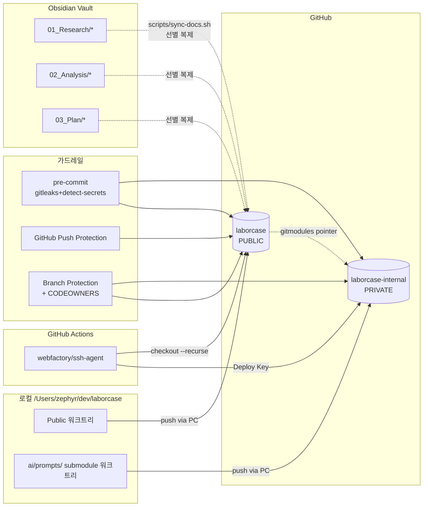

# 🗺️ 계획: laborcase public/private 레포 분리 및 GitHub 연결

## 목표 (What & Why)

이 플랜이 끝났을 때 달성되는 상태:

- 로컬 `/Users/zephyr/dev/laborcase` 가 **두 개의 GitHub 레포**(public `laborcase` + private `laborcase-internal`)에 submodule 로 연결된 git 저장소.
- **첫 커밋에 민감 파일이 섞이지 않았음**이 pre-commit·gitleaks·push protection 의 3중 증거로 보장된다.
- GitHub Actions 가 submodule 을 `webfactory/ssh-agent` + Deploy Key 로 자동 체크아웃한다.
- 외부 기여자가 `git clone` + `./scripts/bootstrap.sh` 만으로 `ai/prompts.example/` 폴백으로 앱을 기동할 수 있다.
- Obsidian Vault 의 research/analysis/plan 최종본이 **선별 복제 스크립트**로 public 레포 `docs/` 에 반영된다.
- 사고 대응 runbook(`docs/runbooks/secret-leak.md`)이 레포에 포함된다.

**왜 지금 먼저인가**: 분석 §A1 에서 확인한 것처럼 로컬이 아직 비-git 상태. 이 상태에서 민감 자산이 public 에 먼저 커밋되면 히스토리에 영구 각인되어 되돌리기 매우 어렵다. API 구현 플랜 Task 0(PoC) 도 이 플랜이 완료된 후에야 코드를 커밋할 안전한 위치가 확보된다.

## 아키텍처 / 구조 개요



## 파일 / 모듈 변경 목록

| 경로 | 신규/수정 | 역할 |
|---|---|---|
| `/Users/zephyr/dev/laborcase/.gitignore` | 신규 | 민감 경로·환경 파일·빌드 아티팩트 차단 |
| `/Users/zephyr/dev/laborcase/.gitattributes` | 신규 | 줄바꿈/언어 통계 설정 |
| `/Users/zephyr/dev/laborcase/.pre-commit-config.yaml` | 신규 | gitleaks + detect-secrets + ruff + ktlint + prettier |
| `/Users/zephyr/dev/laborcase/.secrets.baseline` | 신규 | detect-secrets 베이스라인 (빈 상태로 시작) |
| `/Users/zephyr/dev/laborcase/.editorconfig` | 신규 | 공통 포매팅 |
| `/Users/zephyr/dev/laborcase/README.md` | 수정 | 공공누리 1유형 배지, 부트스트랩 안내, 디스클레이머 |
| `/Users/zephyr/dev/laborcase/LICENSE` | 신규 | public 레포 라이선스 (MIT 또는 Apache-2.0 — Task 0 결정) |
| `/Users/zephyr/dev/laborcase/CODEOWNERS` | 신규 | `/ai/`, `/infra/`, `/docs/legal*` 경로별 리뷰어 |
| `/Users/zephyr/dev/laborcase/.github/workflows/ci.yml` | 신규 | 메인 CI (submodule 체크아웃 포함) |
| `/Users/zephyr/dev/laborcase/.github/workflows/secret-scan.yml` | 신규 | PR 시 trufflehog 실행 |
| `/Users/zephyr/dev/laborcase/.github/pull_request_template.md` | 신규 | 민감성 체크리스트 |
| `/Users/zephyr/dev/laborcase/.gitmodules` | 신규 (git 자동 생성) | submodule 포인터 |
| `/Users/zephyr/dev/laborcase/ai/prompts.example/README.md` | 신규 | 공개 샘플 프롬프트 폴더 안내 |
| `/Users/zephyr/dev/laborcase/ai/prompts.example/system.md` | 신규 | 공개 가능한 샘플 시스템 프롬프트 1개 |
| `/Users/zephyr/dev/laborcase/scripts/bootstrap.sh` | 신규 | 신규 개발자 초기 세팅 스크립트 |
| `/Users/zephyr/dev/laborcase/scripts/sync-docs.sh` | 신규 | Vault → public `docs/` 선별 복제 |
| `/Users/zephyr/dev/laborcase/docs/runbooks/secret-leak.md` | 신규 | 사고 복구 플레이북 |
| `/Users/zephyr/dev/laborcase/docs/decisions/adr-0001-repo-split.md` | 신규 | 이 결정을 ADR 화 |
| `laborcase-internal/README.md` (원격 private 레포) | 신규 | private 레포 목적 설명 |
| `laborcase-internal/system/.gitkeep` 외 구조 | 신규 | private 레포 초기 레이아웃 |

## 작업 단위 (Tasks)

> 모든 task 에 TDD 적용이 어려운 "설정/인프라" 성격이 섞여 있다. 이 경우 **검증 스크립트**를 먼저 작성해 통과해야 구현 완료로 본다 (TDD 정신 유지).

---

### Task 0: 사용자 결정 항목 (2026-04-24 확정)

- **목적**: 구현 전에 되돌리기 어려운 선택지 확정.
- **확정 내용**:
  - ✅ **GitHub 소유 주체**: 개인 계정.
  - ✅ **Public 레포명**: `laborcase` (로컬 디렉토리명과 일치, CLAUDE.md 전제와 일치).
  - ✅ **Private 레포명**: `laborcase-internal` (프롬프트 외 골든셋·매핑 휴리스틱·체크리스트 등 포함 예정이므로 `-prompts` 보다 범용).
  - ✅ **라이선스**: Apache-2.0 (특허 조항 + NO WARRANTY 명시적).
  - ✅ **default branch**: `main`.
  - ✅ **작업 브랜치 정책**: 모든 일상 작업은 **`dev`** 브랜치에서 수행, `main` 은 릴리스 커밋만 받는다. 브랜치 흐름: `feature/* → dev → main`.
  - ⏳ **커밋 서명 정책**: 결정 대기 (기본값: 미필수). Task 6 전까지 확정.
  - ⏳ **API 플랜 §P4** (현행 only vs 구법 포함): 결정 대기 (잠정 `현행 only`).
- **DoD**:
  - [ ] Task 9 의 ADR-0001 에 위 결정 반영.
- **예상 시간**: 0 (이미 확정, 나머지 2건은 Task 6/API플랜 시작 전 사용자 회신으로 해소)

---

### Task 1: 로컬 git 초기화 + `.gitignore` + 디렉토리 스캐폴드

- **목적**: **첫 커밋 전에** 방어선을 세우고, 그 다음 파일을 추가한다. 순서가 역전되면 R1(초기 커밋 유출) 이 현실화.
- **선행 조건**: Task 0.
- **작업 내용**:
  - [ ] 먼저 작성할 검증 스크립트: `scripts/verify-initial-hygiene.sh` — `git ls-files` 결과에 `*.env*`, `*.tfvars`, `*.sa.json`, `ai/prompts/**`(submodule 외 파일), 판례 원본 캐시 경로가 **포함되지 않음**을 assert.
  - [ ] 구현:
    - [ ] `cd /Users/zephyr/dev/laborcase && git init -b main`.
    - [ ] 첫 커밋 직후 `git checkout -b dev` 로 작업 브랜치 생성. 이후 일상 작업은 `dev` 에서.
    - [ ] `.gitignore` 작성 (Kotlin/Gradle + Node/Next.js + Python/venv + Terraform + IntelliJ + macOS + `ai/prompts/` except `ai/prompts.example/` + `*.env*` + `infra/**/*.tfvars` + `*.sa.json` + 판례 raw 캐시 경로).
    - [ ] `.gitattributes` (`* text=auto`, `*.sh text eol=lf`).
    - [ ] `.editorconfig`.
    - [ ] 빈 디렉토리 스캐폴드: `frontend/ api/ ai/prompts.example/ pipeline/ infra/ docs/ scripts/ .claude/agents/` — 각각 `.gitkeep` 또는 최소 README.
    - [ ] `ai/prompts/` 는 아직 submodule 로 만들지 않은 상태. 이 경로는 `.gitignore` 에 선언되어 있어 로컬에 뭐가 있든 추적 안 됨.
  - [ ] 리팩토링: `.gitignore` 를 언어별 섹션으로 구분, 주석으로 출처(gitignore.io 등) 명시.
- **DoD**:
  - [ ] `scripts/verify-initial-hygiene.sh` 통과.
  - [ ] `git status` 결과에 의도한 파일만 나열됨.
- **검증 방법**: 스크립트 + `git ls-files | head -50` 수동 확인.
- **예상 시간**: 2h

---

### Task 2: pre-commit + gitleaks + detect-secrets 설정

- **목적**: 로컬·CI 양쪽에서 민감 패턴 차단 (§P5 1~2 계층).
- **선행 조건**: Task 1.
- **작업 내용**:
  - [ ] 먼저 작성할 검증 테스트: `tests/pre-commit-regression/leaking.sh` — 임시 작업 트리에 GCP 서비스계정 JSON 을 만들고 `pre-commit run --all-files` 가 FAIL 하는지, 해당 파일이 staged 되지 않는지 검증.
  - [ ] 구현:
    - [ ] `.pre-commit-config.yaml`:
      - [ ] `gitleaks/gitleaks` hook (protect 모드)
      - [ ] `Yelp/detect-secrets` hook + `--baseline .secrets.baseline`
      - [ ] `pre-commit/pre-commit-hooks` (trailing-whitespace, end-of-file-fixer, check-yaml, check-merge-conflict, check-added-large-files `--maxkb=500`)
      - [ ] 언어별: ktlint(Kotlin), ruff(Python), eslint/prettier(TS) — 스터브만, 실제 활성화는 해당 디렉토리에 소스가 생긴 뒤.
    - [ ] `.secrets.baseline` 생성 (`detect-secrets scan --baseline .secrets.baseline`).
    - [ ] `pre-commit install` 로 git hook 연결.
  - [ ] 리팩토링: 속도 문제 시 `files:` 필터로 범위 축소.
- **DoD**:
  - [ ] 회귀 테스트 통과.
  - [ ] 샘플 시크릿 문자열로 커밋 시도 → pre-commit 이 차단.
- **검증 방법**: 스크립트 + 수동 `git commit` 시도.
- **예상 시간**: 2h

---

### Task 3: GitHub 레포 2개 생성 + 초기 push

- **목적**: 원격에 저장소를 만들고, **검증된 로컬 커밋**을 올린다. 민감 파일이 없음을 재확인한 뒤 push.
- **선행 조건**: Task 1, 2.
- **작업 내용**:
  - [ ] 먼저 작성할 검증: push 직전 `scripts/verify-initial-hygiene.sh && gitleaks detect --no-banner` 을 실행해 clean 확인. 스크립트 하나로 묶어 `scripts/verify-before-push.sh` 라 명명.
  - [ ] 구현:
    - [ ] `gh repo create zephyrous/laborcase --public --description "..." --confirm`
    - [ ] `gh repo create zephyrous/laborcase-internal --private --description "..." --confirm`
    - [ ] 로컬 메인에 remote 추가: `git remote add origin git@github.com:zephyrous/laborcase.git`
    - [ ] 첫 커밋 (main): `feat: initial scaffold with hygiene gates` (Conventional Commits, CLAUDE.md §125).
    - [ ] `git push -u origin main`.
    - [ ] `git checkout -b dev && git push -u origin dev` — 작업 브랜치 원격에 생성.
    - [ ] 별도 디렉토리에 private 레포 clone → 초기 구조(`system/`, `retrieval/`, `output-guard/`, `tests/` + README) main 에 push → dev 브랜치 생성/push.
  - [ ] 리팩토링: private 레포 README 에 "이 레포는 laborcase public 레포의 submodule 로 포함된다" 명시.
- **DoD**:
  - [ ] 두 레포가 GitHub 에 존재하고 초기 커밋이 올라감.
  - [ ] `gh repo view <owner>/laborcase --json visibility` 결과가 `"public"`, prompts 쪽은 `"private"`.
  - [ ] Push Protection 이 public 레포에서 기본 활성 확인 (`gh api repos/<owner>/laborcase`).
- **검증 방법**: GitHub UI + `gh` CLI.
- **예상 시간**: 1.5h

---

### Task 4: Submodule 연결 + `prompts.example/` 폴백

- **목적**: public 레포 `ai/prompts/` 를 private 레포로 포인터 연결. 동시에 폴백 경로 확보.
- **선행 조건**: Task 3.
- **작업 내용**:
  - [ ] 먼저 작성할 검증: `scripts/verify-submodule.sh` — (a) `.gitmodules` 에 `ai/prompts` 존재, (b) public `git ls-files` 에 `ai/prompts/` 실제 파일 없음(포인터뿐), (c) `ai/prompts.example/` 에 최소 1개 `.md` 존재.
  - [ ] 구현:
    - [ ] `ai/prompts.example/system.md` 에 공개 가능한 범용 시스템 프롬프트 초안(법적 표현 제약 가드 포함) 1개.
    - [ ] `ai/prompts.example/README.md`: "이 폴더는 민감하지 않은 샘플입니다. 실제 운영 프롬프트는 `ai/prompts/` submodule 에 있으며 접근 권한 필요."
    - [ ] public 레포에서 `git submodule add git@github.com:<owner>/laborcase-internal.git ai/prompts`.
    - [ ] `.gitmodules` 생성 확인, 커밋.
    - [ ] `git push`.
  - [ ] 리팩토링: 빌드 스크립트(후속 API/프론트 플랜) 가 `ai/prompts/` 미체크아웃 시 `ai/prompts.example/` 로 심볼릭 링크·복사하도록 가이드 문서만 `docs/runbooks/prompts-fallback.md` 에.
- **DoD**:
  - [ ] 검증 스크립트 통과.
  - [ ] 새 디렉토리에서 `git clone --recurse-submodules <public>` → `ai/prompts/` 에 실제 파일이 나타남.
  - [ ] 같은 작업을 `--no-recurse-submodules` 로 하면 `ai/prompts/` 비어있고 `ai/prompts.example/` 는 채워져 있음.
- **검증 방법**: 임시 디렉토리에서 clone 2회 비교.
- **예상 시간**: 2h

---

### Task 5: Deploy Key + GitHub Actions 체크아웃 워크플로

- **목적**: CI 에서 submodule 을 안전하게 체크아웃 (§P3).
- **선행 조건**: Task 4.
- **작업 내용**:
  - [ ] 먼저 작성할 검증: 워크플로 안에 `git submodule status` 를 실행하는 step 을 둬서 커밋 해시가 찍히면 성공.
  - [ ] 구현:
    - [ ] 로컬에서 `ssh-keygen -t ed25519 -C laborcase-internal-deploy -f key` 로 키 쌍 생성. **지문만** 기록, 원본은 1Password(또는 사용자 Secret 보관소)에.
    - [ ] public 키를 `laborcase-internal` 에 `Deploy key` 로 등록 (read-only).
    - [ ] private 키를 `laborcase` 의 Actions Secret `DEPLOY_KEY_INTERNAL` 에 저장.
    - [ ] `.github/workflows/ci.yml`:
      ```yaml
      jobs:
        build:
          steps:
            - uses: webfactory/ssh-agent@v0.9.0
              with:
                ssh-private-key: ${{ secrets.DEPLOY_KEY_INTERNAL }}
            - uses: actions/checkout@v4
              with:
                submodules: recursive
            - run: git submodule status
      ```
    - [ ] fork PR 에서는 secret 미주입이 기본 → 해당 job 은 `ai/prompts/` 없이도 통과해야 함. `continue-on-error: true` 는 사용하지 않고, 빌드 스텝이 폴백 모드로 동작해야 한다는 가이드 문서화.
  - [ ] 리팩토링: 다중 private 레포 대비 `ssh-private-key: |` 파이프 포맷으로 미리 맞춰두기.
- **DoD**:
  - [ ] 워크플로 1회 실행에서 submodule status 가 커밋 해시 출력.
  - [ ] 외부 fork 에서 낸 PR 에서도 workflow 가 실패하지 않음 (폴백 동작 검증은 후속 API/프론트 플랜에서).
- **검증 방법**: GitHub Actions 실행 로그.
- **예상 시간**: 2h

---

### Task 6: CODEOWNERS + Branch Protection + Push Protection 검증

- **목적**: §P5 의 4~5 계층(사람 게이트, 브랜치 보호) 완성.
- **선행 조건**: Task 3.
- **작업 내용**:
  - [ ] 먼저 작성할 검증: `scripts/verify-protection.sh` — `gh api repos/<owner>/laborcase/branches/main/protection` 응답을 파싱해 (a) required reviews ≥ 1, (b) required status checks 에 CI 포함, (c) push 제한 활성, (d) Secret scanning + Push protection `enabled=true`.
  - [ ] 구현:
    - [ ] `CODEOWNERS`:
      ```
      /ai/                @zephyrous
      /infra/             @zephyrous
      /docs/legal*        @zephyrous
      /docs/runbooks/*    @zephyrous
      ```
    - [ ] main 브랜치 보호: `gh api -X PUT repos/<owner>/laborcase/branches/main/protection -f ...` 또는 UI.
      - [ ] required_pull_request_reviews: 1명, CODEOWNERS 강제.
      - [ ] required_status_checks: `ci / build`, `secret-scan / trufflehog`.
      - [ ] enforce_admins: false (1인 팀 긴급 대응 여지).
      - [ ] allow_force_pushes: false.
      - [ ] require_signed_commits: Task 0 결정에 따름.
    - [ ] **dev 브랜치 보호 (일상 작업용)**: main 보다 느슨하게.
      - [ ] required_status_checks: `ci / build`, `secret-scan / trufflehog` (동일).
      - [ ] required_pull_request_reviews: 선택적(1인 팀이라 비활성 가능).
      - [ ] allow_force_pushes: false (실수 방지).
      - [ ] feature/* → dev PR, dev → main 릴리스 PR 흐름 문서화.
    - [ ] private 레포에도 동일 설정 축약 적용 (main + dev).
    - [ ] Push Protection·Secret Scanning 활성 확인 (public 기본 on, private 은 Advanced Security 필요 — 현 계획에선 public 만 커버).
    - [ ] `.github/pull_request_template.md`:
      - [ ] 민감성 체크리스트 (API 키·서비스계정·내부 URL 노출 여부).
      - [ ] 법적 표현 제약 준수 체크박스 (CLAUDE.md §법적 제약 참조).
  - [ ] 리팩토링: 위 gh 명령을 `scripts/setup-branch-protection.sh` 로 idempotent 하게.
- **DoD**:
  - [ ] 검증 스크립트 통과.
  - [ ] 강제 push 테스트(별도 브랜치) 시도 → 차단됨.
- **검증 방법**: 스크립트 + 고의 위반 시도.
- **예상 시간**: 2h

---

### Task 7: 사고 복구 runbook + 분기 로테이션 리마인더

- **목적**: §R3, §R7 완화. 문서는 미리, 자동 리마인더는 경량으로.
- **선행 조건**: Task 5, 6.
- **작업 내용**:
  - [ ] 구현:
    - [ ] `docs/runbooks/secret-leak.md` 작성:
      1. 즉시 로테이션 (법제처 OC, GCP SA 키, Deploy Key).
      2. 히스토리 제거(`git filter-repo`) 절차 + 팀 재클론 공지 템플릿.
      3. 포크 조회(`gh api repos/.../forks`) + 삭제 요청 이메일 템플릿.
      4. 사후 회고 템플릿 (5 whys).
    - [ ] `docs/runbooks/deploy-key-rotation.md`: 분기 1회, 새 키 페어 생성 → 추가 → 기존 삭제 (단절 없게 **추가-검증-삭제** 순서).
    - [ ] GitHub `schedule` 워크플로 `.github/workflows/rotation-reminder.yml`: 분기 1일자에 이슈 자동 생성.
  - [ ] 리팩토링: runbook 들을 `docs/runbooks/README.md` 인덱스에서 링크.
- **DoD**:
  - [ ] runbook 2건 커밋.
  - [ ] schedule workflow 를 `workflow_dispatch` 로 수동 1회 실행 → 이슈 1건 생성 확인.
- **검증 방법**: 수동 dispatch + 이슈 확인.
- **예상 시간**: 2h

---

### Task 8: Vault → public `docs/` 선별 복제 스크립트

- **목적**: §P7 옵션 D 자동화. CLAUDE.md 사용자 원칙 5번 준수.
- **선행 조건**: Task 3.
- **작업 내용**:
